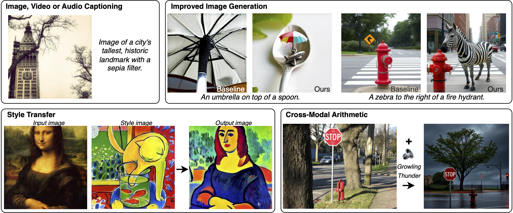

# LLMs can see and hear without any training

Official implementation of the paper **LLMs can see and hear without any training**.

[](https://arxiv.org/pdf/2501.18096.pdf)



## Installation

Install the conda environment using

```bash
conda env create -f environment.yml
conda activate MILS
```


## Dataset and checkpoints

Download the following datasets, annotations, and checkpoints

**MS-COCO**: Download the MS-COCO validation dataset from the official website [here](https://cocodataset.org/#download). Also, download the 5000 samples test split used in Karpathy et al., *Deep visual-semantic alignments for generating image descriptions*, CVPR 2015.

```bash
wget http://images.cocodataset.org/zips/val2014.zip
wget http://images.cocodataset.org/annotations/annotations_trainval2014.zip 

unzip val2014.zip
unzip annotations_trainval2014.zip
```

**Clotho**: Download the clotho dataset from the official website [here](https://zenodo.org/records/3490684). We use the test split of this dataset for our benchmarking.

```bash
wget https://zenodo.org/records/3490684/files/clotho_audio_evaluation.7z
pip3 install dtrx
wget https://www.7-zip.org/a/7z2107-linux-x64.tar.xz
tar xf 7z2107-linux-x64.tar.xz
./7zz e clotho_audio_evaluation.7z
wget https://zenodo.org/records/3490684/files/clotho_captions_evaluation.csv

```

**MSR-VTT**: Download the dataset from [here](https://cove.thecvf.com/datasets/839). We use the test split of this dataset.

```bash
wget https://www.robots.ox.ac.uk/~maxbain/frozen-in-time/data/MSRVTT.zip
unzip MSRVTT.zip
```


**ViClip-InternVid-10M-FLT.pth**: Download from 
[here](https://huggingface.co/OpenGVLab/ViCLIP/blob/main/ViClip-InternVid-10M-FLT.pth) and set the correct path in `task_utils/video/viclip.py`.

## Updating the paths

Update the variables in [paths.py](paths.py) to set the dataset directory, and the output folder.

## Running the code

MILS is an inference-only method that can be run on a single A100 GPU. We run the experiments on eight A100 GPUs, and the code below can be adjusted for any number of GPUs.

### Image captioning

Generate captions using

```bash
CUDA_VISIBLE_DEVICES=0 python main_image_captioning.py --process 0 --num_processes 8 --batch_size 32 &
CUDA_VISIBLE_DEVICES=1 python main_image_captioning.py --process 1 --num_processes 8 --batch_size 32 &
CUDA_VISIBLE_DEVICES=2 python main_image_captioning.py --process 2 --num_processes 8 --batch_size 32 &
CUDA_VISIBLE_DEVICES=3 python main_image_captioning.py --process 3 --num_processes 8 --batch_size 32 &
CUDA_VISIBLE_DEVICES=4 python main_image_captioning.py --process 4 --num_processes 8 --batch_size 32 &
CUDA_VISIBLE_DEVICES=5 python main_image_captioning.py --process 5 --num_processes 8 --batch_size 32 &
CUDA_VISIBLE_DEVICES=6 python main_image_captioning.py --process 6 --num_processes 8 --batch_size 32 &
CUDA_VISIBLE_DEVICES=7 python main_image_captioning.py --process 7 --num_processes 8 --batch_size 32 &
```

The captions are saved in `OUTPUT_DIR`. Specify this path in `ours_result_path` variable in `eval/image_captioning.py` and then obtain captioning metrics as

```bash
python eval/image_captioning.py
```


### Audio captioning

Generate captions using

```bash
CUDA_VISIBLE_DEVICES=0 python main_audio_captioning.py --process 0 --num_processes 8 --batch_size 32 &
CUDA_VISIBLE_DEVICES=1 python main_audio_captioning.py --process 1 --num_processes 8 --batch_size 32 &
CUDA_VISIBLE_DEVICES=2 python main_audio_captioning.py --process 2 --num_processes 8 --batch_size 32 &
CUDA_VISIBLE_DEVICES=3 python main_audio_captioning.py --process 3 --num_processes 8 --batch_size 32 &
CUDA_VISIBLE_DEVICES=4 python main_audio_captioning.py --process 4 --num_processes 8 --batch_size 32 &
CUDA_VISIBLE_DEVICES=5 python main_audio_captioning.py --process 5 --num_processes 8 --batch_size 32 &
CUDA_VISIBLE_DEVICES=6 python main_audio_captioning.py --process 6 --num_processes 8 --batch_size 32 &
CUDA_VISIBLE_DEVICES=7 python main_audio_captioning.py --process 7 --num_processes 8 --batch_size 32 &
```

The captions are saved in `OUTPUT_DIR`. Specify this path in `address` variable in `eval/audio_captioning.py` and then obtain captioning metrics as

```bash
python eval/audio_captioning.py
```

### Video captioning

Generate captions using

```bash
CUDA_VISIBLE_DEVICES=0 python main_video_captioning.py --process 0 --num_processes 8 --batch_size 8 &
CUDA_VISIBLE_DEVICES=1 python main_video_captioning.py --process 1 --num_processes 8 --batch_size 8 &
CUDA_VISIBLE_DEVICES=2 python main_video_captioning.py --process 2 --num_processes 8 --batch_size 8 &
CUDA_VISIBLE_DEVICES=3 python main_video_captioning.py --process 3 --num_processes 8 --batch_size 8 &
CUDA_VISIBLE_DEVICES=4 python main_video_captioning.py --process 4 --num_processes 8 --batch_size 8 &
CUDA_VISIBLE_DEVICES=5 python main_video_captioning.py --process 5 --num_processes 8 --batch_size 8 &
CUDA_VISIBLE_DEVICES=6 python main_video_captioning.py --process 6 --num_processes 8 --batch_size 8 &
CUDA_VISIBLE_DEVICES=7 python main_video_captioning.py --process 7 --num_processes 8 --batch_size 8 &
```

The captions are saved in `OUTPUT_DIR`. Specify this path in `ours_result_path` variable in `eval/video_captioning.py` and then obtain captioning metrics as

```bash
python eval/video_captioning.py
```

### High-quality image generation

Generate high-quality image using

```bash
CUDA_VISIBLE_DEVICES=0 python main_image_generation_enhancement.py --process 0 --num_processes 8 --batch_size 4 &
CUDA_VISIBLE_DEVICES=1 python main_image_generation_enhancement.py --process 1 --num_processes 8 --batch_size 4 &
CUDA_VISIBLE_DEVICES=2 python main_image_generation_enhancement.py --process 2 --num_processes 8 --batch_size 4 &
CUDA_VISIBLE_DEVICES=3 python main_image_generation_enhancement.py --process 3 --num_processes 8 --batch_size 4 &
CUDA_VISIBLE_DEVICES=4 python main_image_generation_enhancement.py --process 4 --num_processes 8 --batch_size 4 &
CUDA_VISIBLE_DEVICES=5 python main_image_generation_enhancement.py --process 5 --num_processes 8 --batch_size 4 &
CUDA_VISIBLE_DEVICES=6 python main_image_generation_enhancement.py --process 6 --num_processes 8 --batch_size 4 &
CUDA_VISIBLE_DEVICES=7 python main_image_generation_enhancement.py --process 7 --num_processes 8 --batch_size 4 &
```

The image generations are saved in `OUTPUT_DIR`.

### Style transfer

Put the style and content image in the `images/` folder, and run 

```bash
python main_style_transfer.py --style_image <style_image> --content_image <content_image>
```

The output is saved in `OUTPUT_DIR`.

### Cross-modal arithmetic

We first use image captioning to convert image to text. Also, we use audio captioning to convert audio to text. Next, we combine the captions into an image generation prompt from the LLM, please see the paper for exact prompt details. The prompt is then fed to the high-quality image generation using `CustomArithmetic.csv` as the initial prompt.

## Issues

Please open an issue in this repository (preferred for better visibility) or reach out to [kumar.ashutosh@utexas.edu](mailto:kumar.ashutosh@utexas.edu).

## Contributing

See the [CONTRIBUTING](CONTRIBUTING.md) file for how to help out.

## License

`MILS` is made available under a [CC-by-NC 4.0 license](LICENSE.md), however third party content pulled from other locations are subject to their own licenses and you may have other legal obligations or restrictions that govern your use of that content.

## Cite

If you use this work, please cite:

```bibtex
@inproceedings{ashutosh2025llms,
  title={LLMs can see and hear without any training},
  author={Ashutosh, Kumar and Gandelsman, Yossi and Chen, Xinlei and Misra, Ishan and Girdhar, Rohit},
  booktitle={ICML},
  year={2025}
}
```

